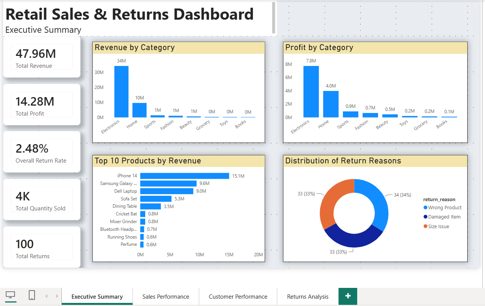
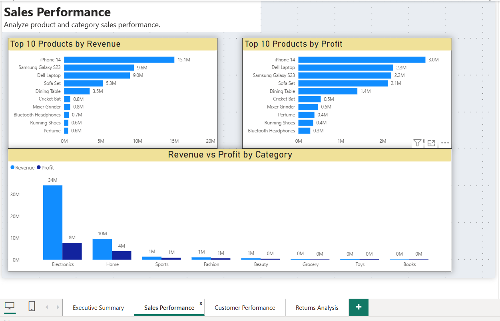
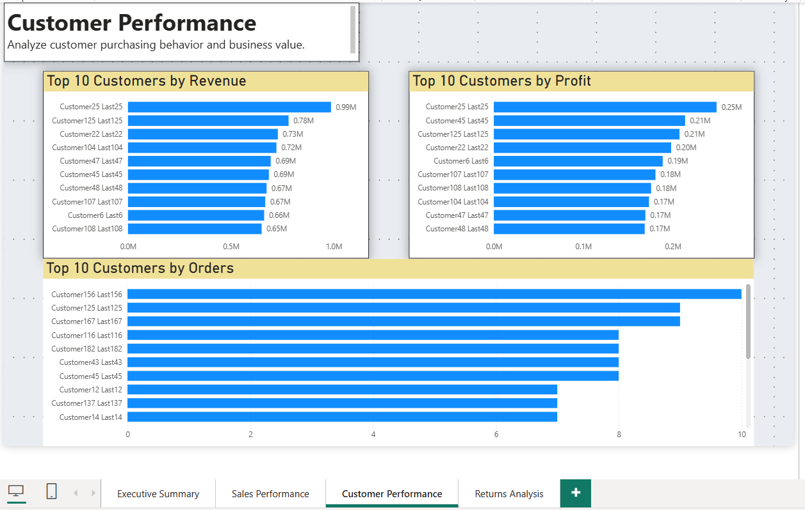
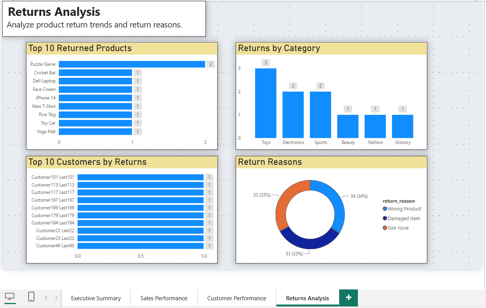

# 📊 Retail Sales & Returns Analysis | SQL Server + Power BI


A complete **Business Intelligence** solution built using **SQL Server** and **Power BI** that transforms raw retail sales data into actionable business insights through reusable SQL views and an interactive dashboard.

---

# 📌 Project Overview

The **Retail Sales & Returns Analysis Dashboard** is an end-to-end Business Intelligence project designed to help retail businesses monitor sales performance, customer purchasing behavior, product profitability, and return trends.

The project demonstrates a complete analytics workflow, beginning with data preparation in **SQL Server**, where reusable SQL views were created to simplify reporting, followed by the development of an interactive **Power BI dashboard** for business users.

The dashboard enables stakeholders to monitor key business metrics, identify trends, and make data-driven decisions.

---

# 🎯 Business Problem

Retail businesses generate thousands of sales transactions and product returns over time. Without proper reporting and analysis, it becomes difficult to answer important business questions such as:

- Which products generate the highest revenue?
- Which product categories are the most profitable?
- Who are the highest-value customers?
- Which products are returned most frequently?
- Why are customers returning products?
- What are the overall business KPIs?

This project was developed to answer these questions using SQL Server and Power BI.

---

# ⚙️ Project Workflow

```text
Raw Retail Dataset
        │
        ▼
SQL Server Database
        │
        ▼
Data Cleaning & Transformation
        │
        ▼
Reusable SQL Views
        │
        ▼
Power BI Dashboard
        │
        ▼
Business Insights
```

---

# 🗂️ Dataset Description

The project uses a retail sales dataset containing transactional and master data stored in SQL Server.

## Tables Used

| Table | Description |
|--------|-------------|
| customers | Customer information |
| orders | Sales order details |
| order_items | Individual products within each order |
| products | Product information |
| categories | Product categories |
| returns | Product return records |

---

# 🛠️ Tools Used

| Tool | Purpose |
|------|---------|
| SQL Server | Data querying, joins, aggregations, and reusable SQL Views |
| Power BI | Interactive dashboard development and business reporting |

---

# 💼 Skills Demonstrated

- SQL Joins
- GROUP BY & Aggregations
- SQL Views
- Data Transformation
- Business KPI Analysis
- Customer Analytics
- Product Performance Analysis
- Returns Analysis
- Dashboard Design
- Data Visualization
- Business Intelligence Reporting

---

# 🗄️ SQL Views Created

To simplify reporting and improve dashboard performance, reusable SQL views were created.

| SQL View | Purpose |
|----------|---------|
| **vw_product_performance** | Product revenue and profit analysis |
| **vw_category_performance** | Category revenue and profit analysis |
| **vw_customer_performance** | Customer revenue, profit, and order analysis |
| **vw_return_details** | Detailed returned product information |
| **vw_product_return_analysis** | Product-wise return analysis |
| **vw_category_return_analysis** | Category-wise return analysis |
| **vw_return_reason_analysis** | Return reason analysis |

---

# 📈 Key Performance Indicators (KPIs)

The dashboard tracks the following business metrics:

- 💰 Total Revenue
- 📈 Total Profit
- 📦 Total Quantity Sold
- 🔄 Total Returns
- 📊 Overall Return Rate

---

# 📊 Dashboard Pages

## 📌 Executive Summary

Provides a high-level overview of business performance using KPI cards and category-level analysis.

**Visuals Included**

- Total Revenue
- Total Profit
- Total Quantity Sold
- Total Returns
- Overall Return Rate
- Revenue by Category
- Profit by Category
- Top Revenue Products
- Return Reasons

---

## 📌 Sales Performance

Analyzes revenue and profitability across products and categories.

**Visuals Included**

- Top Revenue Products
- Top Profit Products
- Revenue vs Profit by Category

---

## 📌 Customer Performance

Identifies the most valuable customers based on purchasing behavior.

**Visuals Included**

- Top Customers by Revenue
- Top Customers by Profit
- Top Customers by Orders

---

## 📌 Returns Analysis

Provides insights into product returns and customer return behavior.

**Visuals Included**

- Top Returned Products
- Returns by Category
- Return Reasons
- Top Customers by Returns

---

# 🖼️ Dashboard Preview

| Executive Summary | Sales Performance |
|-------------------|-------------------|
|  |  |

| Customer Performance | Returns Analysis |
|----------------------|------------------|
|  |  |

---

# 💡 Key Business Insights

The dashboard enables business users to:

- Identify the highest revenue-generating products.
- Compare profitability across product categories.
- Discover the most valuable customers.
- Monitor business performance using key KPIs.
- Analyze return trends across products and categories.
- Understand common product return reasons.
- Support data-driven business decision making.

---

# 📁 Repository Structure

```text
Retail-Sales-Returns-Analysis
│
├── README.md
├── Retail-Sales-Returns-Analysis.pbix
├── Retail-Sales-SQL-Script.sql
├── Project-Documentation.pdf
├── Executive-Summary.png
├── Sales-Performance.png
├── Customer-Performance.png
└── Returns-Analysis.png
```

---

# 🚀 Future Improvements

Potential enhancements for future versions of this project:

- Add monthly and yearly sales trend analysis
- Implement sales forecasting
- Add regional sales performance
- Build drill-through report pages
- Connect the dashboard to a live SQL Server database
- Automate dashboard refresh

---

# ⭐ Project Highlights

- ✔ End-to-End Data Analytics Project
- ✔ SQL Server Database
- ✔ Reusable SQL Views
- ✔ Interactive Power BI Dashboard
- ✔ Business KPI Reporting
- ✔ Customer Performance Analysis
- ✔ Product Performance Analysis
- ✔ Returns Analysis
- ✔ Business Intelligence Reporting

---

# 👨‍💻 Author

**Sahil Pawar**

Aspiring Data Analyst

**GitHub:** https://github.com/SahilPawar0603

**LinkedIn:** *(Add your LinkedIn profile link here)*

---

## ⭐ Support

If you found this project useful or interesting, consider giving the repository a **Star**. It helps others discover the project and supports my learning journey.

Thank you for visiting!
